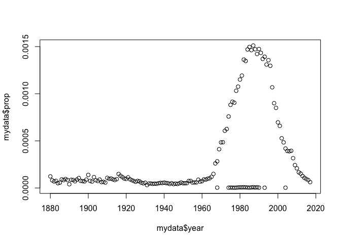
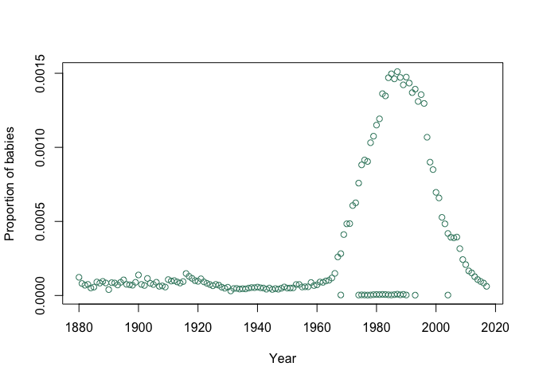
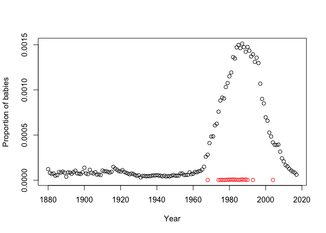

EVE 109 Section Week 1
================

### 1. Installing R and RStudio

For most of our analysis in this class, we will work with the programming language "R". RStudio is a software that provides a nice interface for using R. The very first thing we need to do is install both R and RStudio. The following link has instructions for installing R and RStudio on any laptop:

<https://datacarpentry.org/R-ecology-lesson/#setup_instructions>

This website has many tutorials that are relevant to the types of analyses biologists need. Take a moment and install R and RStudio on your laptop. If you are going to be doing homework on a different computer, you will want to install the software on that computer as well.

     

### 2. Tour of RStudio

Next we will take a tour of RStudio as a class. We will cover:
1. The console
2. Scripts
3. Commenting
4. Executing Commands
5. Asking for help

     

### 3. Installing packages

Some special functions or datasets can be downloaded as packages. To install them, we use the `install.packages` command:

``` r
install.packages("babynames")
```

You only have to install a package once because the package is downloaded to your computer. However, each time you use a package you will need to tell R you are using commands from that package. It's good practice to place this at the top of your script.

``` r
library(babynames)
```

     

### 4. Basic functions in R

R can perform basic mathematical functions, just like a calculator. Type the following into the console and press enter:

``` r
10 + 5   # Add ten and five
```

    ## [1] 15

To do more complicated analyses, and to make scripts generalizable, we often want to assign values to objects. Type the following in your R script, then execute

``` r
myvalue <- 10
```

The arrow `<-` is how we assign a value to an object. In general, it is better to assign values to objects rather than do math directly on the values. That is because if we want to do several different operations on `myvalue` but might want to change it later, we only have to change it in one place. Once you have stored a value you can print it, or you can use it to perform further mathematical functions:

``` r
myvalue   #print myvalue
```

    ## [1] 10

 

``` r
print(myvalue)   #print myvalue
```

    ## [1] 10

There's really no difference between these two ways to print an object  

``` r
myvalue + 5   #add 5 to myvalue
```

    ## [1] 15

 

``` r
newvalue <- myvalue + 5
```

 

``` r
newvalue
```

    ## [1] 15

Note: You can choose any name you want for an object, but be careful! The name should be short (you may have to type it many times), but informative (so you don't get it confused with other objects). You cannot use spaces and you cannot begin an object name with a number. You can use capitalization and underscore to your advantage, for example: *thisIsAnObject* or *this\_is\_an\_object*

 

### *Exercise*: Write a script to find out what fraction of your life you've been at UC Davis

Include objects for your age and the number of years you've been at Davis. Have the script print the answer. Put up your green card when you're done.

     

### 5. Classes

R can work with more than just numbers, it can handle a variety of data formats. You can use the function `class` to check the type of data:

``` r
class(myvalue)
```

    ## [1] "numeric"

 

But what happens if we assign an object to something other than a number?

``` r
season <- "fall"
class(season)
```

    ## [1] "character"

 

Two somewhat confusing classes are `character` and `factor`. `character` means a string of letters while `factor` represents categorical data. For plotting and summarizing, we often want `factor` data. We can convert `character` data to `factor` data using the `as.factor` command:

``` r
class(season)
```

    ## [1] "character"

``` r
length(season) #this tells you how many letters there are
```

    ## [1] 1

``` r
season_factor <- as.factor(season)
length(season) #this tells you how many dat apoints therer are
```

    ## [1] 1

     

### 6. Vectors and dataframes

Usually we want to look at more than one number or value at once. For a single set of values, we can use a **vector**. To make a vector, we use the `c()` function (c stands for combine)

``` r
seasons <- c("fall","winter","spring","summer")
```

 

Perhaps the most common way to format data is in a dataframe. This is basically a spreadsheet, like you would make in Excel. R has a few example dataframes that we can use. We installed one earlier when we installed the babynames package. Look at the top of this dataframe (the `head` command gives just the first 5 entries):

``` r
head(babynames)
```

    ## # A tibble: 6 x 5
    ##    year sex   name          n   prop
    ##   <dbl> <chr> <chr>     <int>  <dbl>
    ## 1  1880 F     Mary       7065 0.0724
    ## 2  1880 F     Anna       2604 0.0267
    ## 3  1880 F     Emma       2003 0.0205
    ## 4  1880 F     Elizabeth  1939 0.0199
    ## 5  1880 F     Minnie     1746 0.0179
    ## 6  1880 F     Margaret   1578 0.0162

``` r
dim(babynames)  # how many rows and columns are in the dataframe?
```

    ## [1] 1924665       5

`dim` gives you the dimensions of the dataframe.
 

Remember, we can always use `?` to ask for help. If we want a description of the babynames dataframe:

``` r
?babynames
```

     

### 7. Subsetting

Sometimes we want to examine a specific portion of the data. There are several ways to do this. For a two-dimensional dataframe you can use square bracket notation `[x,y]` where x is the rows you want and y is the columns you want. Like this:

``` r
babynames[1:4,c(2,3)]   #take the first four rows and columns 2 & 3
```

    ## # A tibble: 4 x 2
    ##   sex   name     
    ##   <chr> <chr>    
    ## 1 F     Mary     
    ## 2 F     Anna     
    ## 3 F     Emma     
    ## 4 F     Elizabeth

Notice the `:` gives me all the integers between 1 and 4.

 

You can also ask for columns by name using the `$` notation. This means you can use the column name to ask for a single column out of the dataframe. Note that this does not work for rows.

``` r
head(babynames$name)
```

    ## [1] "Mary"      "Anna"      "Emma"      "Elizabeth" "Minnie"    "Margaret"

 

You can use the `subset` function to ask for rows that meet certain criteria. Notice the double `==`. You use this when you are comparing values.

``` r
myname <- subset(babynames,name=="Rachael")   # take just the entries where name = "Rachael"
head(myname)
```

    ## # A tibble: 6 x 5
    ##    year sex   name        n      prop
    ##   <dbl> <chr> <chr>   <int>     <dbl>
    ## 1  1880 F     Rachael    12 0.000123 
    ## 2  1881 F     Rachael     8 0.0000809
    ## 3  1882 F     Rachael     8 0.0000692
    ## 4  1883 F     Rachael     9 0.0000750
    ## 5  1884 F     Rachael     7 0.0000509
    ## 6  1885 F     Rachael     8 0.0000564

``` r
dim(myname)
```

    ## [1] 158   5

     

### 8. Plotting

R is great for plotting. The simplest type of plot is just an x,y scatterplot:

``` r
plot(myname$year,myname$prop)
```



Use `?` to look at the options for plotting. For example, here I add more informative axis labels and choose a nice color for the points:

``` r
plot(myname$year,myname$prop,
     ylab="Proportion of babies",
     xlab="Year",
     col="aquamarine4")
```



Notice that I used new lines (returns) to make this more readable. R doesn't care where you put white space, so use it to make your code as organized as possible.
 

Of course, it's better if color is informative, so lets use it to learn something. Isn't it weird that there are a bunch of points at 0 and other points with higher proportions during the same time frame? Maybe those points are different in some way. Lets try this:

``` r
plot(myname$year,myname$prop,
     ylab="Proportion of babies",
     xlab="Year",
     col=as.factor(myname$sex))
```



### *Exercise*: Describe this plot in plain english. What conclusions can we draw?

       

Homework
========

Each week, you will submit a script for homework. While most of the concepts you will need will be taught during section, you may have to look up some commands online (remember, Google is your friend!).

The top of your script should contain commented lines with the following:

``` r
#Name
#Date
#EVE 109 Homework
#Week ##
```

 

I should be able to execute the script. When printed answers are expected, you should store them in an object and have a line of code above should have a comment telling me where the answer is printed. For example:

``` r
#Answer to Question 1
print(myvalue)
```

 

If the answer requires a plot, follow the same format, with a comment indicating that this plot answers a homework question:

``` r
#Answer to Question 2
plot(myname$year,myname$prop)
```

 

***Show your work and comment your code. You will only receive full credit for clean, organized code***

 

### *Homework 1: Write a script that does the following:*

#### 1. Plot the use of your name over time (Or pick a different name). Only include points for one gender.

#### 2. What proportion of babies had your name when it was most popular?

#### 3. In which year was your name most popular?
